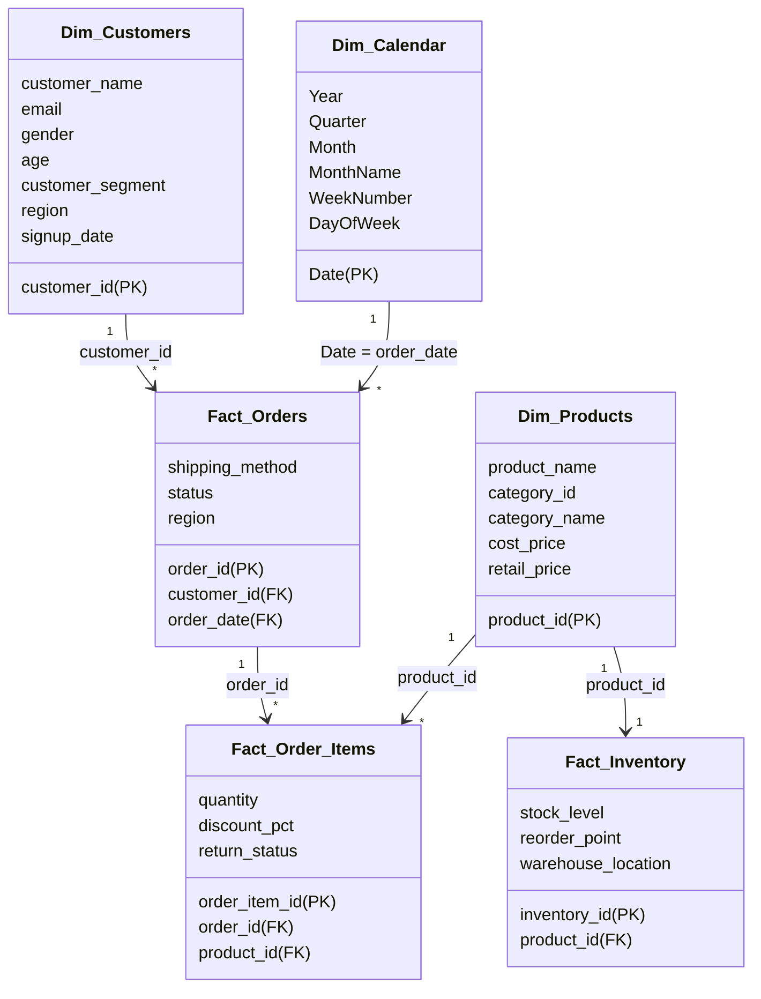

# Power BI Data Modeling & Dashboard Architecture

This document describes how to structure and design the **E-Commerce Sales & Inventory Analytics** Power BI dashboard.

## 1. Data Model Structure (Star Schema)

For optimal DAX performance and clean reporting, load the processed CSV files into Power BI and model them as a Star Schema:



### Table Relationships in Power BI

1. **Customers to Orders**:
   - **Cardinality**: `1-to-many` (1 Customer can have many Orders)
   - **Cross filter direction**: `Single` (Customers filters Orders)
   - **Keys**: `customer_id` -> `customer_id`

2. **Products to Order_Items**:
   - **Cardinality**: `1-to-many` (1 Product can be bought in many Order Items)
   - **Cross filter direction**: `Single` (Products filters Order Items)
   - **Keys**: `product_id` -> `product_id`

3. **Orders to Order_Items**:
   - **Cardinality**: `1-to-many` (1 Order can contain multiple Order Items)
   - **Cross filter direction**: `Single` (Orders filters Order Items)
   - **Keys**: `order_id` -> `order_id`

4. **Products to Inventory**:
   - **Cardinality**: `1-to-1` (1 Product maps to 1 Inventory record)
   - **Cross filter direction**: `Both` (Products filters Inventory, and vice versa)
   - **Keys**: `product_id` -> `product_id`

5. **Calendar to Orders**:
   - **Cardinality**: `1-to-many` (1 Date maps to multiple Order Dates)
   - **Cross filter direction**: `Single` (Calendar filters Orders)
   - **Keys**: `Date` -> `order_date`

---

## 2. Power Query Data Transformation (ETL)

Before creating relationships, verify these transformations in Power Query Editor:
* **Merge Categories & Products**: Open the `Products` query and execute a **Merge Queries** with `Categories` on `category_id`. Expand the `category_name` column, then disable the load on the raw `Categories` query. This flattens product dimensions.
* **Remove Duplicates**: Ensure no duplicate rows exist in `Dim_Customers` or `Dim_Products` by applying "Remove Duplicates" on primary key columns.
* **Generate Calendar Table**: Add a blank query, paste the following M-code to generate a dynamic Calendar table:
  ```powerquery
  let
      Source = List.Dates(#date(2024,1,1), Duration.Days(#date(2025,12,31) - #date(2024,1,1)) + 1, #duration(1,0,0,0)),
      #"Converted to Table" = Table.FromList(Source, Splitter.SplitByNothing(), null, null, ExtraValues.Error),
      #"Renamed Columns" = Table.RenameColumns(#"Converted to Table",{{"Column1", "Date"}}),
      #"Changed Type" = Table.TransformColumnTypes(#"Renamed Columns",{{"Date", type date}}),
      #"Inserted Year" = Table.AddColumn(#"Changed Type", "Year", each Date.Year([Date]), Int64.Type),
      #"Inserted Month" = Table.AddColumn(#"Inserted Year", "Month", each Date.Month([Date]), Int64.Type),
      #"Inserted Month Name" = Table.AddColumn(#"Inserted Month", "MonthName", each Date.MonthName([Date]), type text),
      #"Inserted Quarter" = Table.AddColumn(#"Inserted Month Name", "Quarter", each Date.QuarterOfYear([Date]), Int64.Type)
  in
      #"Inserted Quarter"
  ```

---

## 3. Interactive Report Layout Design

### Page 1: Executive Sales Performance
Focuses on gross, net revenue, costs, and profit metrics over time.
* **Top KPIs**: 
  - Card: `Total Sales` (formatted as Currency)
  - Card: `Total Profit`
  - Card: `Profit Margin %`
  - Card: `Total Orders`
* **Visuals**:
  - **Monthly Revenue & Profit (Line & Stacked Column Chart)**: Columns represent `Total Sales`, line represents `Profit Margin %` over months.
  - **Category Breakdown (Treemap)**: Shows `Total Sales` sized by product categories, colored in shades of Corporate Navy.
  - **Shipping Impact (Donut Chart)**: Distribution of orders by shipping method (Standard, Second Day, Same Day).
* **Filters/Slicers**: Year (Calendar[Year]), Region (Orders[region]), Segment (Customers[customer_segment]).

### Page 2: Customer Cohorts & Regional Analytics
Focuses on customer age and gender segmentation, repeat buyer patterns, and regional profitability.
* **Top KPIs**: 
  - Card: `Average Order Value (AOV)`
  - Card: `Return Rate %` (Color format: Red text if > 4%)
  - Card: `Customer Lifetime Value (CLV)`
* **Visuals**:
  - **Sales by Customer Segment & Region (Clustered Column Chart)**: X-axis represents `Region`, Y-axis is `Total Sales`, Legend is `customer_segment`.
  - **Age Demographics vs Revenue (Scatter Plot)**: X-axis is `Age`, Y-axis is `Total Sales` per customer, colored/grouped by `gender`.
  - **Product Returns (Bar Chart)**: Horizontal bar chart showing `Return Rate %` by `category_name` to flag quality issues.
* **Interactivity**: Drill-through enabled on `Region` to view detailed orders.

### Page 3: Inventory Optimization & Alerts
Provides warehouse managers with restock and reorder priorities.
* **Top KPIs**: 
  - Card: `Total Current Stock`
  - Card: `Reorder Point Alert Count` (Formatted red alert fill if > 0)
  - Card: `Out of Stock Products`
* **Visuals**:
  - **Restock Alert Table (Table Visual)**: Lists Product Name, Warehouse Location, Current Stock Level, and Reorder Point. Add conditional formatting to highlight rows where `stock_level <= reorder_point`.
  - **Warehouse Stock Distribution (Stacked Bar Chart)**: X-axis is `warehouse_location`, Y-axis is `Total Current Stock`, Legend is `category_name`.
  - **Stock status indicator (Gauge)**: Shows total current stock compared to historical sales.
